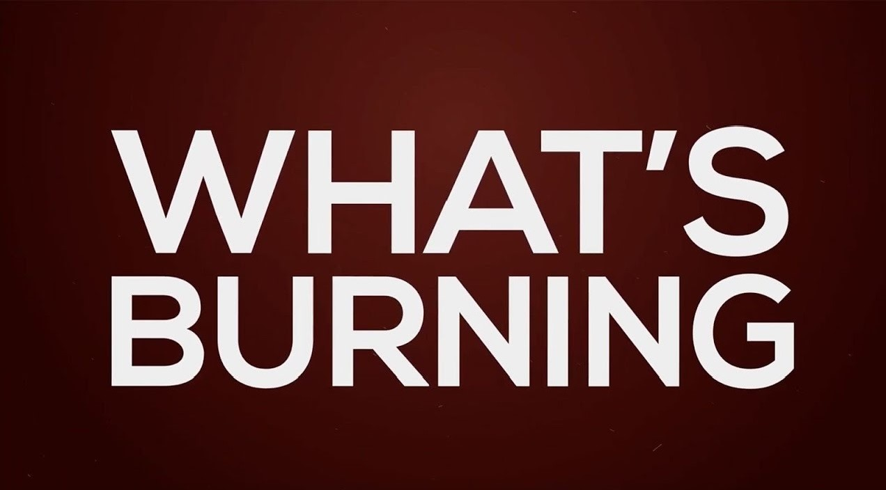

# **What´s Burning?** 🔥 🇦🇷
 ## *IA - Procesamiento de Imágenes - Redes Convolucionales CNN.* 
 Este es un Proyecto utilizando IA, más precisamente la aplicación de Redes CNN (Convolutional Neuronal Network) al procesamiento de imágenes".
 
 
# **Proyecto** :technologist:
 - **Número** --> 3er Proyecto
 - **Tipo** --> Notebook/Colab - IA - Redes CNN - Procesamiento de Imágenes.
 - **Lenguaje Utilizado** --> Python
 - **Curso** --> Python Analytics 
 - **Carrera** --> Desarrollador Python
 - **Institución Educativa** --> Inove Coding School
 
 
 # **Librería y Módulos Utilizados** :books: :point_right:
 - **colab** ---> servicio cloud - jupyter notebook
 - **keras - tensorflow**
 - **scikit-learn**
 - **matplotlib**
 - **seaborn**
 - **numpy**
 - **pandas**
 - **os**
 - **platform**
 - **glob**
 - **gdown**
 
 
 # **Fuente de los datos**
Dataset extraído de la página de "Kaggle: Your Machine Learning and Data Science Community" 
 
<a href="https://www.kaggle.com/escofresco/whats-burning"><h4>Dataset source</h4></a>
 
 
 # **Requerimientos** 📋
Para poder ejecutar esta aplicación, será necesario tener instalada la versión 3.6 de Python o superior. También es necesario incluir los módulos especificados arriba.
Es recomendable usar el servicio cloud Google Colaboratory (Colab), modificando el entorno de ejecución, en GPU, para acelerar el procesamiento y ejecución del notebook.
Recomendamos antes de descargar el repositorio, realizar los siguientes pasos:

```
pip3 install pip -U --upgrade    # Actualizar pip
pip3 install -U numpy 
pip3  install matplotlib
pip3 install -U seaborn
pip3 install seaborn
pip3 install pandas
pip3 install scipy
pip3 install -U scikit-learn
pip3 install -U jupyterlab
--------- Opcional ----------
pip3 install opencv-python
pip3 install tensorflow==2.3.1
pip3 install keras
```
 
 
 # **Descripción** :page_facing_up:
El dataset "whats-burning" pesa alrededor de 500Mbytes y contiene 3801 imágenes a color, por un lado distintas imágenes con fuego y por otro lado imágenes donde no hay fuego o simplemente humo. Cada pixel de cada imagen, al ser de color, posee 3 canales de profundidad (R, G, B).

Una vez obtenido las imágenes que van a hacer nuestras "entradas" se procede a realizar un pipeline con el fin de obtener nuestras "salidas" (target), que en este caso, son 2 clases con las siguiente etiquetas: "not_fire" "fire".

Finalmente, el fin de este notebook es poder predecir usando IA, si una imagen posee fuego o no.


# **Pipeline Utilizado:**

- Recolectar Datos
- Procesar Datos
- Explorar Datos
- Entrenar Modelo
- Validar Modelo
- Utilzar Modelo
- Conclusiones

 
 # **Modos de Uso** 🔧⚙️
Descargue el repositorio en su pc y utilice jupyter lab, para accede al jupyter notebook, o bien, utilice el servicio cloud Google Colaboratory "Colab" (este último siendo recomendado por los recursos utilizados durante la ejecución del programa).
 
 
# **Autor** ✒️
:octocat: **Torres Molina, Emmanuel Oscar** 
 
 
# **Contacto** :e-mail: :point_down:
 - ***email:*** emmaotm@gmail.com
 - ***Mis Otros Repositorios*** --> [Click](https://github.com/eotorresmolina?tab=repositories)
 

# **Versión y Última Actualización** :heavy_check_mark:
 - **Versión:** 1.1
 - **Última Actualización:** 05-06-2021


# **Licencia** 📄 :balance_scale:
Este proyecto tiene un propósito meramente académico y con fines de práctica. Es por ello que no existe garantía en su implementación debido a que se trata de una demostración de uso gratuito que aún está en desarrollo. 


# **Consulta y/o Problemas** :question:
  Ante Cualquier mal funcionamiento del Programa y/o consultas acerca del uso del mismo pueden mandarme un mensaje al mail que más arriba se detalla.
  
  Muchas Gracias por tomarte el tiempo de ver el repositorio y haber llegado hasta acá.
  
  Saludos cordiales.
  
  Emmanuel Torres Molina.
